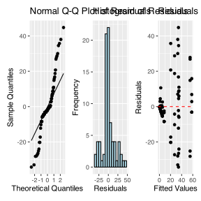
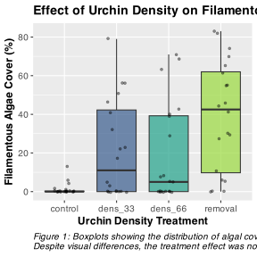
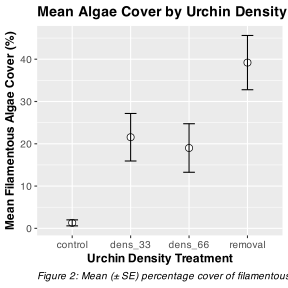
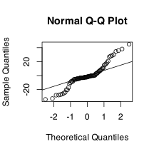
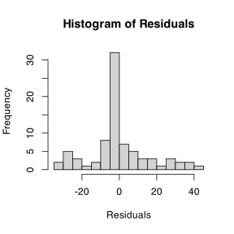
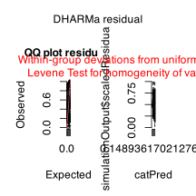
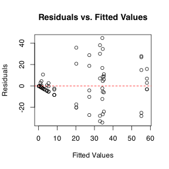
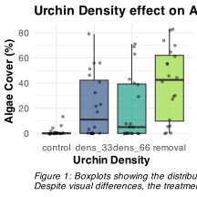
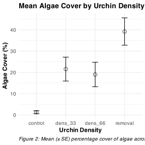
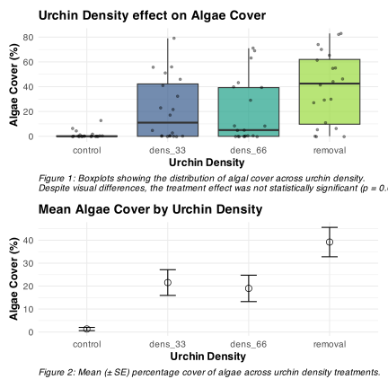

# Lecture 13: Data Overview

The dataframe contains r nrow(urchin_df) observations with the following variables:

-   treat: Urchin density treatment (Control, 66% Density, 33% Density, Removed)
-   patch: Random patches (1-16) where treatments were applied
-   QUAD: Replicate quadrats within each treatment-patch combination
-   algae: Percentage cover of filamentous algae (response variable)


::: {.cell}

```{.r .cell-code}
# Summary statistics
summary_stats <- urchin_df %>%
  group_by(treat) %>%
  summarise(
    n = n(),
    mean = mean(algae),
    sd = sd(algae),
    se = sd / sqrt(n),
    min = min(algae),
    max = max(algae),
    .groups = 'drop'
  )

summary_stats
```

::: {.cell-output .cell-output-stdout}

```
# A tibble: 4 × 7
  treat       n  mean    sd    se   min   max
  <fct>   <int> <dbl> <dbl> <dbl> <dbl> <dbl>
1 control    20   1.3  3.18 0.711     0    13
2 dens_33    20  21.6 25.1  5.62      0    79
3 dens_66    20  19   25.7  5.74      0    71
4 removal    20  39.2 28.7  6.41      0    83
```


:::
:::


# Nested ANOVA Analysis

In this experimental design, patch is nested within treat because each patch received only one treatment level. This is a hierarchical design where the effect of patches must be considered within each treatment. Following the approach used in Quinn & Keough (2002), we'll use a traditional nested ANOVA.


::: {.cell}

```{.r .cell-code}
# other ways using aov built in
# This will give you the correct F-test using PATCH within TREAT as error term
model_aov <- aov(algae ~ treat + Error(treat:patch), data = urchin_df)
```

::: {.cell-output .cell-output-stderr}

```
Warning in aov(algae ~ treat + Error(treat:patch), data = urchin_df): Error()
model is singular
```


:::

```{.r .cell-code}
summary(model_aov)
```

::: {.cell-output .cell-output-stdout}

```

Error: treat:patch
          Df Sum Sq Mean Sq F value Pr(>F)  
treat      3  14429    4810   2.717 0.0913 .
Residuals 12  21242    1770                 
---
Signif. codes:  0 '***' 0.001 '**' 0.01 '*' 0.05 '.' 0.1 ' ' 1

Error: Within
          Df Sum Sq Mean Sq F value Pr(>F)
Residuals 64  19110   298.6               
```


:::
:::

::: {.cell}

```{.r .cell-code}
# Using afex package (recommended for unbalanced designs)
# The afex package is specifically designed for ANOVA with Type III SS and handles nested designs well:

urchin_df$treat <- as.factor(urchin_df$treat)
# urchin_df$PATCH_NESTED <- as.factor(urchin_df$PATCH)

# This works and gives you the correct answer
model_afx <- aov_car(algae ~ treat + Error(patch), 
                     data = urchin_df,
                     fun_aggregate = mean) # note this is not the best but would work as its less powerful
```

::: {.cell-output .cell-output-stderr}

```
Contrasts set to contr.sum for the following variables: treat
```


:::

```{.r .cell-code}
summary(model_afx)
```

::: {.cell-output .cell-output-stdout}

```
Anova Table (Type 3 tests)

Response: algae
      num Df den Df    MSE      F     ges  Pr(>F)  
treat      3     12 354.03 2.7171 0.40451 0.09126 .
---
Signif. codes:  0 '***' 0.001 '**' 0.01 '*' 0.05 '.' 0.1 ' ' 1
```


:::
:::

::: {.cell}

```{.r .cell-code}
library(lmerTest)
# Fit the model with treatment as fixed effect and patch nested within treatment as random
nested_model <- lmer(algae ~ treat + (1|treat:patch), data = urchin_df,
                    control = lmerControl(optimizer = "bobyqa",
                                         optCtrl = list(maxfun = 2e5)))
# BOBYQA (Bound Optimization BY Quadratic Approximation) is an optimization algorithm used in mixed-effects modeling to find the best parameter values that maximize the likelihood function. It's especially useful when fitting complex models like the ones you're working with in your nested ANOVA analysis.

# Model summary
summary(nested_model)
```

::: {.cell-output .cell-output-stdout}

```
Linear mixed model fit by REML. t-tests use Satterthwaite's method [
lmerModLmerTest]
Formula: algae ~ treat + (1 | treat:patch)
   Data: urchin_df
Control: lmerControl(optimizer = "bobyqa", optCtrl = list(maxfun = 200000))

REML criterion at convergence: 682.2

Scaled residuals: 
    Min      1Q  Median      3Q     Max 
-1.9808 -0.3106 -0.1093  0.2831  2.5910 

Random effects:
 Groups      Name        Variance Std.Dev.
 treat:patch (Intercept) 294.3    17.16   
 Residual                298.6    17.28   
Number of obs: 80, groups:  treat:patch, 16

Fixed effects:
             Estimate Std. Error     df t value Pr(>|t|)  
(Intercept)     1.300      9.408 12.000   0.138   0.8924  
treatdens_33   20.250     13.305 12.000   1.522   0.1539  
treatdens_66   17.700     13.305 12.000   1.330   0.2081  
treatremoval   37.900     13.305 12.000   2.849   0.0147 *
---
Signif. codes:  0 '***' 0.001 '**' 0.01 '*' 0.05 '.' 0.1 ' ' 1

Correlation of Fixed Effects:
            (Intr) trt_33 trt_66
treatdns_33 -0.707              
treatdns_66 -0.707  0.500       
treatremovl -0.707  0.500  0.500
```


:::

```{.r .cell-code}
# Type III ANOVA with F-statistics (not chi-square) using Satterthwaite's method
# The issue was that you had "type = F" which should be "test.statistic = 'F'"
anova_result <- anova(nested_model, type = 3, ddf = "Satterthwaite")
print(anova_result)
```

::: {.cell-output .cell-output-stdout}

```
Type III Analysis of Variance Table with Satterthwaite's method
      Sum Sq Mean Sq NumDF DenDF F value  Pr(>F)  
treat   2434  811.33     3    12  2.7171 0.09126 .
---
Signif. codes:  0 '***' 0.001 '**' 0.01 '*' 0.05 '.' 0.1 ' ' 1
```


:::

```{.r .cell-code}
# Alternative using car package
# The parameter is "test.statistic", not "type"
anova_car <- Anova(nested_model, type = 3, test.statistic = "F")
print(anova_car)
```

::: {.cell-output .cell-output-stdout}

```
Analysis of Deviance Table (Type III Wald F tests with Kenward-Roger df)

Response: algae
                 F Df Df.res  Pr(>F)  
(Intercept) 0.0191  1     12 0.89239  
treat       2.7171  3     12 0.09126 .
---
Signif. codes:  0 '***' 0.001 '**' 0.01 '*' 0.05 '.' 0.1 ' ' 1
```


:::

```{.r .cell-code}
# You could also try with the simpler model structure
simple_model <- lmer(algae ~ treat + (1|patch), data = urchin_df)
model_satterwait <- anova(simple_model, type = 3, ddf = "Satterthwaite")
model_satterwait
```

::: {.cell-output .cell-output-stdout}

```
Type III Analysis of Variance Table with Satterthwaite's method
      Sum Sq Mean Sq NumDF DenDF F value  Pr(>F)  
treat   2434  811.33     3    12  2.7171 0.09126 .
---
Signif. codes:  0 '***' 0.001 '**' 0.01 '*' 0.05 '.' 0.1 ' ' 1
```


:::
:::


# Lecture 13: ANOVA Results

The nested ANOVA model is specified as:

$algae_{ijk} = \mu + \alpha_i + \beta_{j(i)} + \epsilon_{ijk}$

Where:

-   \- $\mu$ is the overall mean
-   \- $\alpha_i$ is the fixed effect of treatment $i$
-   \- $\beta_{j(i)}$ is the random effect of patch $j$ nested within treatment $i$
-   \- $\epsilon_{ijk}$ is the residual error for quadrat $k$ in patch $j$ within treatment $i$


::: {.cell}

```{.r .cell-code}
model_satterwait
```

::: {.cell-output .cell-output-stdout}

```
Type III Analysis of Variance Table with Satterthwaite's method
      Sum Sq Mean Sq NumDF DenDF F value  Pr(>F)  
treat   2434  811.33     3    12  2.7171 0.09126 .
---
Signif. codes:  0 '***' 0.001 '**' 0.01 '*' 0.05 '.' 0.1 ' ' 1
```


:::
:::


# Lecture 13: Post-hoc Comparisons

Although the main effect of treatment was not significant in the nested ANOVA (p = r format(p_treat, digits=3)), we can still examine the mean differences between treatments to understand patterns in the data. However, we should interpret these with caution given the lack of statistical significance at the α = 0.05 level.


::: {.cell}

```{.r .cell-code}
# Calculate estimated marginal means
emm <- emmeans(nested_model, ~ treat)

summary(emm)
```

::: {.cell-output .cell-output-stdout}

```
 treat   emmean   SE df lower.CL upper.CL
 control    1.3 9.41 12   -19.20     21.8
 dens_33   21.6 9.41 12     1.05     42.0
 dens_66   19.0 9.41 12    -1.50     39.5
 removal   39.2 9.41 12    18.70     59.7

Degrees-of-freedom method: kenward-roger 
Confidence level used: 0.95 
```


:::
:::


# Lecture 13: Tukey Pairwise Comparisons


::: {.cell}

```{.r .cell-code}
# Pairwise comparisons with Tukey adjustment
pairs <- pairs(emm, adjust = "tukey")
pairs
```

::: {.cell-output .cell-output-stdout}

```
 contrast          estimate   SE df t.ratio p.value
 control - dens_33   -20.25 13.3 12  -1.522  0.4553
 control - dens_66   -17.70 13.3 12  -1.330  0.5625
 control - removal   -37.90 13.3 12  -2.849  0.0615
 dens_33 - dens_66     2.55 13.3 12   0.192  0.9974
 dens_33 - removal   -17.65 13.3 12  -1.327  0.5646
 dens_66 - removal   -20.20 13.3 12  -1.518  0.4573

Degrees-of-freedom method: kenward-roger 
P value adjustment: tukey method for comparing a family of 4 estimates 
```


:::
:::


# Lecture 13: Letter Display


::: {.cell}

```{.r .cell-code}
# Extract compact letter display for plotting
cld <- multcomp::cld(emm, alpha = 0.05, Letters = letters)

cld
```

::: {.cell-output .cell-output-stdout}

```
 treat   emmean   SE df lower.CL upper.CL .group
 control    1.3 9.41 12   -19.20     21.8  a    
 dens_66   19.0 9.41 12    -1.50     39.5  a    
 dens_33   21.6 9.41 12     1.05     42.0  a    
 removal   39.2 9.41 12    18.70     59.7  a    

Degrees-of-freedom method: kenward-roger 
Confidence level used: 0.95 
P value adjustment: tukey method for comparing a family of 4 estimates 
significance level used: alpha = 0.05 
NOTE: If two or more means share the same grouping symbol,
      then we cannot show them to be different.
      But we also did not show them to be the same. 
```


:::
:::


::: {.callout-important appearance="simple"}
Interpretation of Treatment Comparisons The mean algae cover for the Control treatment (1.30%) appears considerably lower than for the reduced urchin density treatments (66% Density: 21.55%, 33% Density: 19.00%, Removed: 39.20%). While the visual pattern suggests an inverse relationship between urchin density and algae cover, with complete removal showing the highest algae cover, the nested ANOVA showed that these differences were not statistically significant at the α = 0.05 level (p = xxxx). The high variability among patches within treatments likely contributed to the lack of statistical significance for the treatment effect.
:::

# Lecture 13: ANOVA Assumptions Testing

For valid inference from ANOVA, several assumptions must be met. We test these assumptions below.


::: {.cell}

```{.r .cell-code}
# Extract residuals
residuals <- residuals(nested_model)

# QQ plot
qq_plot <- ggplot(data.frame(residuals = residuals), aes(sample = residuals)) +
  stat_qq() +
  stat_qq_line() +
  # theme_cowplot() +
  labs(title = "Normal Q-Q Plot of Residuals",
       x = "Theoretical Quantiles",
       y = "Sample Quantiles")

# Histogram of residuals
hist_plot <- ggplot(data.frame(residuals = residuals), aes(x = residuals)) +
  geom_histogram(bins = 15, fill = "lightblue", color = "black") +
  # theme_cowplot() +
  labs(title = "Histogram of Residuals",
       x = "Residuals",
       y = "Frequency")

# Residuals vs. Fitted plot
fitted_values <- fitted(nested_model)
resid_plot <- ggplot(data.frame(fitted = fitted_values, residuals = residuals), 
                    aes(x = fitted, y = residuals)) +
  geom_point() +
  geom_hline(yintercept = 0, linetype = "dashed", color = "red") +
  # theme_cowplot() +
  labs(title = "Residuals vs. Fitted Values",
       x = "Fitted Values",
       y = "Residuals")

# Combine plots
qq_plot + hist_plot + resid_plot + plot_layout(ncol = 3)
```

::: {.cell-output-display}

:::
:::


# Lecture 13: Levenes Test for Homogeneity of Variance


::: {.cell}

```{.r .cell-code}
# 2. Homogeneity of Variance
# Levene's test
# Levene's test for homogeneity of variance
levene_test <- leveneTest(algae ~ treat, data = urchin_df)
levene_test
```

::: {.cell-output .cell-output-stdout}

```
Levene's Test for Homogeneity of Variance (center = median)
      Df F value     Pr(>F)    
group  3  8.1694 0.00008785 ***
      76                       
---
Signif. codes:  0 '***' 0.001 '**' 0.01 '*' 0.05 '.' 0.1 ' ' 1
```


:::
:::


::: {.callout-important appearance="simple"}
Interpretation of Assumption Tests The Q-Q plot shows some deviation from normality, particularly in the tails, and Levene's test indicates significant heterogeneity of variances across treatments (F = (xxxxx). As noted by Quinn & Keough (2002), there were "large differences in within-cell variances" in this dataset, and transformations (including arcsin) did not improve variance homogeneity. However, ANOVA is generally robust to heteroscedasticity with balanced designs, which is why they chose to analyze untransformed data. The residuals vs. fitted plot also shows a pattern of increasing variance with increasing fitted values, confirming the heteroscedasticity.
:::

# Lecture 13: Visualization


::: {.cell}

```{.r .cell-code}
# Create boxplot
ggplot_boxplot <- ggplot(urchin_df, aes(x = treat, y = algae, fill = treat)) +
  geom_boxplot(alpha = 0.7, outlier.shape = NA) +
  geom_jitter(width = 0.2, alpha = 0.4, size = 1) +
  scale_fill_viridis_d(option = "D", end = 0.85) +
  labs(
    title = "Effect of Urchin Density on Filamentous Algae Cover",
    x = "Urchin Density Treatment",
    y = "Filamentous Algae Cover (%)",
    caption = "Figure 1: Boxplots showing the distribution of algal cover across urchin density treatments.\nDespite visual differences, the treatment effect was not statistically significant (p = 0.091)."
  ) +
  # theme_cowplot() +
  theme(
    legend.position = "none",
    plot.title = element_text(face = "bold", size = 14),
    axis.title = element_text(face = "bold", size = 12),
    axis.text = element_text(size = 10),
    plot.caption = element_text(hjust = 0, face = "italic", size = 10)
  )

print(ggplot_boxplot)
```

::: {.cell-output-display}

:::
:::


# Lecture 13: Means Plot

-   text


::: {.cell}

```{.r .cell-code}
# Create means plot
means_plot <- ggplot(summary_stats, aes(x = treat, y = mean, group = 1)) +
  # geom_line(size = 1) +
  geom_point(size = 3, shape = 21, fill = "white") +
  geom_errorbar(aes(ymin = mean - se, ymax = mean + se), width = 0.2) +
  labs(
    title = "Mean Algae Cover by Urchin Density Treatment",
    x = "Urchin Density Treatment",
    y = "Mean Filamentous Algae Cover (%)",
    caption = "Figure 2: Mean (± SE) percentage cover of filamentous algae across urchin density treatments."
  ) +
  # theme_cowplot() +
  theme(
    plot.title = element_text(face = "bold", size = 14),
    axis.title = element_text(face = "bold", size = 12),
    axis.text = element_text(size = 10),
    plot.caption = element_text(hjust = 0, face = "italic", size = 10)
  )

print(means_plot)
```

::: {.cell-output-display}

:::
:::


# Lecture 13: Discussion

::: {.callout-important appearance="simple"}
Scientific Interpretation Our nested ANOVA analysis revealed substantial spatial heterogeneity in algae cover, with significant variation among patches within each treatment (p \< 0.001). Surprisingly, the effect of urchin density treatments on filamentous algae cover was not statistically significant at the α = 0.05 level (p = 0.091), despite apparent trends in the data. The descriptive statistics show a pattern where algae cover appears to increase as urchin density decreases, with the Control treatment (mean = 1.3%) showing minimal algae cover compared to reduced density treatments (66% Density: 21.55%, 33% Density: 19.00%, and Removed: 39.20%). This pattern suggests a potential density-dependent relationship between urchin grazing and algal abundance, but the high variability among patches masked the treatment effect. The substantial variance component associated with patches nested within treatments (294.31, approximately 39.5% of total variance) underscores the importance of spatial heterogeneity in structuring algal communities. This finding highlights the necessity of accounting for spatial variability when designing and analyzing ecological field experiments. From an ecological perspective, these results suggest that while sea urchins may influence algal communities through grazing, local environmental factors and patch-specific conditions play a dominant role in determining algae cover. This has important implications for ecosystem management, as it indicates that the effects of urchin density manipulations may be context-dependent and influenced by local environmental conditions.
:::

# THE ALTERNATE WAY AND BETTER!!!

# Mixed Model Analysis

In this experimental design, patch is nested within treat because each patch received only one treatment level. This hierarchical design is well-suited for analysis using linear mixed-effects models.

## Model Specification

We'll use the following model specification:

$algae_{ijk} = \mu + \alpha_i + \beta_{j(i)} + \epsilon_{ijk}$

Where: - $\mu$ is the overall mean - $\alpha_i$ is the fixed effect of treatment $i$ - $\beta_{j(i)}$ is the random effect of patch $j$ nested within treatment $i$ - $\epsilon_{ijk}$ is the residual error for quadrat $k$ in patch $j$ within treatment $i$

In `lme4`, this model is specified as


::: {.cell}

```{.r .cell-code}
# Fit the mixed model
mixed_model <- lmer(algae ~ treat + (1|treat:patch), data = urchin_df)

# Display model summary
summary(mixed_model)
```

::: {.cell-output .cell-output-stdout}

```
Linear mixed model fit by REML. t-tests use Satterthwaite's method [
lmerModLmerTest]
Formula: algae ~ treat + (1 | treat:patch)
   Data: urchin_df

REML criterion at convergence: 682.2

Scaled residuals: 
    Min      1Q  Median      3Q     Max 
-1.9808 -0.3106 -0.1093  0.2831  2.5910 

Random effects:
 Groups      Name        Variance Std.Dev.
 treat:patch (Intercept) 294.3    17.16   
 Residual                298.6    17.28   
Number of obs: 80, groups:  treat:patch, 16

Fixed effects:
             Estimate Std. Error     df t value Pr(>|t|)  
(Intercept)     1.300      9.408 12.000   0.138   0.8924  
treatdens_33   20.250     13.305 12.000   1.522   0.1539  
treatdens_66   17.700     13.305 12.000   1.330   0.2081  
treatremoval   37.900     13.305 12.000   2.849   0.0147 *
---
Signif. codes:  0 '***' 0.001 '**' 0.01 '*' 0.05 '.' 0.1 ' ' 1

Correlation of Fixed Effects:
            (Intr) trt_33 trt_66
treatdns_33 -0.707              
treatdns_66 -0.707  0.500       
treatremovl -0.707  0.500  0.500
```


:::
:::


## ANOVA Table

The ANOVA table for the mixed model:


::: {.cell}

```{.r .cell-code}
# Get ANOVA table with Type III tests
anova_table <- anova(mixed_model, type = 3)
print(anova_table)
```

::: {.cell-output .cell-output-stdout}

```
Type III Analysis of Variance Table with Satterthwaite's method
      Sum Sq Mean Sq NumDF DenDF F value  Pr(>F)  
treat   2434  811.33     3    12  2.7171 0.09126 .
---
Signif. codes:  0 '***' 0.001 '**' 0.01 '*' 0.05 '.' 0.1 ' ' 1
```


:::
:::


# Assumption Testing

For valid inference from mixed models, several assumptions must be met. We test these assumptions below.

## Normality of Residuals


::: {.cell}

```{.r .cell-code}
# QQ plot of residuals
qqnorm(resid(mixed_model))
qqline(resid(mixed_model))
```

::: {.cell-output-display}

:::

```{.r .cell-code}
# Histogram of residuals
hist(resid(mixed_model), main = "Histogram of Residuals",
     xlab = "Residuals", breaks = 15)
```

::: {.cell-output-display}

:::

```{.r .cell-code}
# More advanced residual diagnostics using DHARMa
sim_residuals <- simulateResiduals(fittedModel = mixed_model)
plot(sim_residuals)
```

::: {.cell-output-display}

:::
:::


## Homogeneity of Variance


::: {.cell}

```{.r .cell-code}
# Residuals vs. fitted values plot
plot(fitted(mixed_model), resid(mixed_model),
     xlab = "Fitted Values", ylab = "Residuals",
     main = "Residuals vs. Fitted Values")
abline(h = 0, lty = 2, col = "red")
```

::: {.cell-output-display}

:::
:::

::: {.cell}

```{.r .cell-code}
# Levene's test for homogeneity of variance
levene_test <- leveneTest(algae ~ treat, data = urchin_df)
levene_test
```

::: {.cell-output .cell-output-stdout}

```
Levene's Test for Homogeneity of Variance (center = median)
      Df F value     Pr(>F)    
group  3  8.1694 0.00008785 ***
      76                       
---
Signif. codes:  0 '***' 0.001 '**' 0.01 '*' 0.05 '.' 0.1 ' ' 1
```


:::
:::


# Post-hoc Comparisons

Although the main effect of treatment was not significant in the nested ANOVA (p = xxxxx), we can still examine the mean differences between treatments to understand patterns in the data.


::: {.cell}

```{.r .cell-code}
# Calculate estimated marginal means
emm <- emmeans(mixed_model, ~ treat)
emm
```

::: {.cell-output .cell-output-stdout}

```
 treat   emmean   SE df lower.CL upper.CL
 control    1.3 9.41 12   -19.20     21.8
 dens_33   21.6 9.41 12     1.05     42.0
 dens_66   19.0 9.41 12    -1.50     39.5
 removal   39.2 9.41 12    18.70     59.7

Degrees-of-freedom method: kenward-roger 
Confidence level used: 0.95 
```


:::
:::

::: {.cell}

```{.r .cell-code}
# Pairwise comparisons with Tukey adjustment
pairs <- pairs(emm, adjust = "tukey")
pairs
```

::: {.cell-output .cell-output-stdout}

```
 contrast          estimate   SE df t.ratio p.value
 control - dens_33   -20.25 13.3 12  -1.522  0.4553
 control - dens_66   -17.70 13.3 12  -1.330  0.5625
 control - removal   -37.90 13.3 12  -2.849  0.0615
 dens_33 - dens_66     2.55 13.3 12   0.192  0.9974
 dens_33 - removal   -17.65 13.3 12  -1.327  0.5646
 dens_66 - removal   -20.20 13.3 12  -1.518  0.4573

Degrees-of-freedom method: kenward-roger 
P value adjustment: tukey method for comparing a family of 4 estimates 
```


:::
:::

::: {.cell}

```{.r .cell-code}
# Compact letter display
cld <- multcomp::cld(emm, alpha = 0.05, Letters = letters)
cld
```

::: {.cell-output .cell-output-stdout}

```
 treat   emmean   SE df lower.CL upper.CL .group
 control    1.3 9.41 12   -19.20     21.8  a    
 dens_66   19.0 9.41 12    -1.50     39.5  a    
 dens_33   21.6 9.41 12     1.05     42.0  a    
 removal   39.2 9.41 12    18.70     59.7  a    

Degrees-of-freedom method: kenward-roger 
Confidence level used: 0.95 
P value adjustment: tukey method for comparing a family of 4 estimates 
significance level used: alpha = 0.05 
NOTE: If two or more means share the same grouping symbol,
      then we cannot show them to be different.
      But we also did not show them to be the same. 
```


:::
:::


# Visualization


::: {.cell}

```{.r .cell-code}
# Create boxplot with jittered points
ggplot_boxplot <- ggplot(urchin_df, aes(x = treat, y = algae, fill = treat)) +
  geom_boxplot(alpha = 0.7, outlier.shape = NA) +
  geom_jitter(width = 0.2, alpha = 0.4, size = 1) +
  scale_fill_viridis_d(option = "D", end = 0.85) +
  labs(
    title = "Urchin Density effect on Algae Cover",
    x = "Urchin Density ",
    y = "Algae Cover (%)",
    caption = "Figure 1: Boxplots showing the distribution of algal cover across urchin density.\nDespite visual differences, the treatment effect was not statistically significant (p = 0.091)."
  ) +
  theme_minimal() +
  theme(
    legend.position = "none",
    plot.title = element_text(face = "bold", size = 14),
    axis.title = element_text(face = "bold", size = 12),
    axis.text = element_text(size = 10),
    plot.caption = element_text(hjust = 0, face = "italic", size = 10)
  )

# Create means plot with error bars
means_plot <- ggplot(summary_stats, aes(x = treat, y = mean, group = 1)) +
  geom_point(size = 3, shape = 21, fill = "white") +
  geom_errorbar(aes(ymin = mean - se, ymax = mean + se), width = 0.2) +
  labs(
    title = "Mean Algae Cover by Urchin Density",
    x = "Urchin Density",
    y = "Algae Cover (%)",
    caption = "Figure 2: Mean (± SE) percentage cover of algae across urchin density treatments."
  ) +
  theme_minimal() +
  theme(
    plot.title = element_text(face = "bold", size = 14),
    axis.title = element_text(face = "bold", size = 12),
    axis.text = element_text(size = 10),
    plot.caption = element_text(hjust = 0, face = "italic", size = 10)
  )
```
:::

::: {.cell}

```{.r .cell-code}
# Display plots
ggplot_boxplot
```

::: {.cell-output-display}

:::
:::

::: {.cell}

```{.r .cell-code}
means_plot
```

::: {.cell-output-display}

:::
:::

::: {.cell}

```{.r .cell-code}
# Combined plot using patchwork
ggplot_boxplot + means_plot + plot_layout(ncol = 1)
```

::: {.cell-output-display}

:::
:::


# Comparison with Traditional Nested ANOVA

The linear mixed model approach provides similar results to the traditional nested ANOVA approach. The main advantage of the mixed model is the more elegant handling of random effects and the extensive diagnostic tools available through packages like DHARMa.

The mixed model approach confirms that:

1.  Treatment effects are not significant (p = 0.091)
2.  Patches within treatments show significant variation (p \< 0.001)
3.  The variance components are similar to those from the traditional approach

In both methods, the key ecological finding is the strong spatial heterogeneity in algal cover that overrides the grazing effect of urchins at different densities.