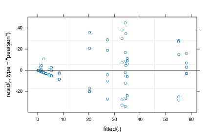
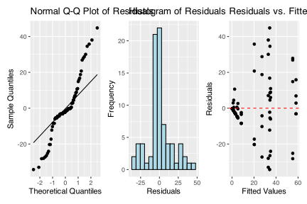
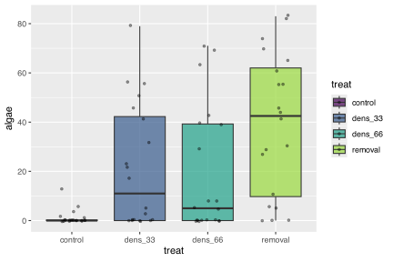
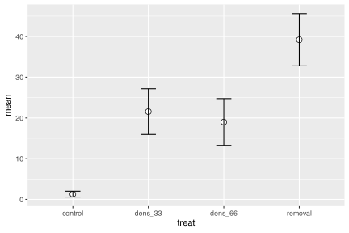

# Lecture 13: Introduction to a nested design the hard way

This analysis examines the effects of varying sea urchin densities on the percentage cover of filamentous algae. The experiment was designed with four urchin density treatments (control, 66% of original density, 33% of original density, and all urchins removed) nested within four random patches. Five replicate quadrats were measured within each treatment-patch combination.

# Lecture 13: Data Overview

The dataframe contains the following variables:

-   treat: Urchin density treatment (Control, 66% Density, 33% Density, Removed)
-   patch: Random patches (1-16) where treatments were applied
-   QUAD: Replicate quadrats within each treatment-patch combination
-   algae: Percentage cover of filamentous algae (response variable)

## Read data and make factors


::: {.cell}

```{.r .cell-code}
# Load and prepare data
urchin_df <- read_csv("data/andrew.csv") %>% clean_names()

# Convert treat to factor with meaningful labels
urchin_df <- urchin_df %>% 
  mutate(treat = as_factor(treat),
         patch = as_factor(patch))

levels(urchin_df$treat)
```

::: {.cell-output .cell-output-stdout}

```
[1] "control" "dens_33" "dens_66" "removal"
```


:::
:::


## Summary statistics


::: {.cell}

```{.r .cell-code}
# Summary statistics
summary_stats <- urchin_df %>%
  group_by(treat) %>%
  summarise(
    n = n(),
    mean = mean(algae),
    sd = sd(algae),
    se = sd / sqrt(n),
    min = min(algae),
    max = max(algae)
  )
summary_stats
```

::: {.cell-output .cell-output-stdout}

```
# A tibble: 4 × 7
  treat       n  mean    sd    se   min   max
  <fct>   <int> <dbl> <dbl> <dbl> <dbl> <dbl>
1 control    20   1.3  3.18 0.711     0    13
2 dens_33    20  21.6 25.1  5.62      0    79
3 dens_66    20  19   25.7  5.74      0    71
4 removal    20  39.2 28.7  6.41      0    83
```


:::
:::


## Manual nested ANOVA

In this experimental design, patch is nested within treat because each patch received only one treatment level. This is a hierarchical design where the effect of patches must be considered within each treatment. Following the approach used in Quinn & Keough (2002), we'll use a traditional nested ANOVA. Note that you could make this easy and take the averages of the response variable algae and go from there but your power is significantly reduced.


::: {.cell}

```{.r .cell-code}
# # Calculate means for each patch (simplifies the analysis)
# patch_means <- urchin_df %>%
#   group_by(treat, patch) %>%
#   summarize(algae_mean = mean(algae), .groups = "drop")

# # 1. Treatment effect - using lm on patch means
# lm_treat <- lm(algae_mean ~ treat, data = patch_means)
# anova_treat <- anova(lm_treat)

# 2. Full model for patch effect and residual - proper nesting notation
# Use the formula: response ~ fixed + Error(random)
# We can't directly do this with lm(), so let's use aov() which handles it
# First, get the standard ANOVA table to extract MS values
fact_model <- aov(algae ~ treat + treat:patch, data = urchin_df)
fact_model
```

::: {.cell-output .cell-output-stdout}

```
Call:
   aov(formula = algae ~ treat + treat:patch, data = urchin_df)

Terms:
                   treat treat:patch Residuals
Sum of Squares  14429.14    21241.95  19110.40
Deg. of Freedom        3          12        64

Residual standard error: 17.28005
48 out of 64 effects not estimable
Estimated effects may be unbalanced
```


:::

```{.r .cell-code}
summary(fact_model)
```

::: {.cell-output .cell-output-stdout}

```
            Df Sum Sq Mean Sq F value       Pr(>F)    
treat        3  14429    4810  16.108 0.0000000658 ***
treat:patch 12  21242    1770   5.928 0.0000008323 ***
Residuals   64  19110     299                         
---
Signif. codes:  0 '***' 0.001 '**' 0.01 '*' 0.05 '.' 0.1 ' ' 1
```


:::
:::


# Anova Table of the model

This is really a regular factorial anova and is really not appropriate as it is pseudoreplicated.


::: {.cell}

```{.r .cell-code}
Anova(fact_model, type = 2)
```

::: {.cell-output .cell-output-stdout}

```
Anova Table (Type II tests)

Response: algae
            Sum Sq Df F value        Pr(>F)    
treat        14429  3 16.1075 0.00000006579 ***
treat:patch  21242 12  5.9282 0.00000083226 ***
Residuals    19110 64                          
---
Signif. codes:  0 '***' 0.001 '**' 0.01 '*' 0.05 '.' 0.1 ' ' 1
```


:::
:::


# The factorial anova is not correct

the error term is really patch nested in treatments but we can specify that the problem is that we cant really handle unbalanced designs


::: {.cell}

```{.r .cell-code}
# Explicitly specify the nesting
# This will give you the correct F-test using patch within treat as error term
nested_model <- aov(algae ~ treat + Error(treat:patch), data = urchin_df)
summary(nested_model)
```

::: {.cell-output .cell-output-stdout}

```

Error: treat:patch
          Df Sum Sq Mean Sq F value Pr(>F)  
treat      3  14429    4810   2.717 0.0913 .
Residuals 12  21242    1770                 
---
Signif. codes:  0 '***' 0.001 '**' 0.01 '*' 0.05 '.' 0.1 ' ' 1

Error: Within
          Df Sum Sq Mean Sq F value Pr(>F)
Residuals 64  19110   298.6               
```


:::
:::


# What to do if it is unbalanced design

and you are from the 80's and had big hair


::: {.cell}

```{.r .cell-code}
# Using afex package (recommended for unbalanced designs)
# The afex package is specifically designed for ANOVA with 
# Type III SS and handles nested designs pretty well:

# This works and gives you the correct answer
model_afx <- aov_car(algae ~ treat + Error(patch), 
                     data = urchin_df,
                     fun_aggregate = mean)
summary(model_afx)
```

::: {.cell-output .cell-output-stdout}

```
Anova Table (Type 3 tests)

Response: algae
      num Df den Df    MSE      F     ges  Pr(>F)  
treat      3     12 354.03 2.7171 0.40451 0.09126 .
---
Signif. codes:  0 '***' 0.001 '**' 0.01 '*' 0.05 '.' 0.1 ' ' 1
```


:::
:::


# now the modern way is to do a mixed model anova


::: {.cell}

```{.r .cell-code}
# Fit the model with treatment as fixed effect and patch nested within treatment as random
random_model <- lmer(algae ~ treat + (1|treat:patch), data = urchin_df,
                    control = lmerControl(optimizer = "bobyqa",
                                         optCtrl = list(maxfun = 2e5)))

# BOBYQA (Bound Optimization BY Quadratic Approximation) is an optimization algorithm used in mixed-effects modeling to find the best parameter values that maximize the likelihood function. It's especially useful when fitting complex models like the ones you're working with in your nested ANOVA analysis.

# Model summary
summary(random_model)
```

::: {.cell-output .cell-output-stdout}

```
Linear mixed model fit by REML. t-tests use Satterthwaite's method [
lmerModLmerTest]
Formula: algae ~ treat + (1 | treat:patch)
   Data: urchin_df
Control: lmerControl(optimizer = "bobyqa", optCtrl = list(maxfun = 200000))

REML criterion at convergence: 682.2

Scaled residuals: 
    Min      1Q  Median      3Q     Max 
-1.9808 -0.3106 -0.1093  0.2831  2.5910 

Random effects:
 Groups      Name        Variance Std.Dev.
 treat:patch (Intercept) 294.3    17.16   
 Residual                298.6    17.28   
Number of obs: 80, groups:  treat:patch, 16

Fixed effects:
             Estimate Std. Error     df t value Pr(>|t|)  
(Intercept)     1.300      9.408 12.000   0.138   0.8924  
treatdens_33   20.250     13.305 12.000   1.522   0.1539  
treatdens_66   17.700     13.305 12.000   1.330   0.2081  
treatremoval   37.900     13.305 12.000   2.849   0.0147 *
---
Signif. codes:  0 '***' 0.001 '**' 0.01 '*' 0.05 '.' 0.1 ' ' 1

Correlation of Fixed Effects:
            (Intr) trt_33 trt_66
treatdns_33 -0.707              
treatdns_66 -0.707  0.500       
treatremovl -0.707  0.500  0.500
```


:::
:::

::: {.cell}

```{.r .cell-code}
# Type III ANOVA with F-statistics (not chi-square) using Satterthwaite's method
# The issue was that you had "type = F" which should be "test.statistic = 'F'"
random_result <- anova(random_model, type = 3, ddf = "Satterthwaite")
random_result
```

::: {.cell-output .cell-output-stdout}

```
Type III Analysis of Variance Table with Satterthwaite's method
      Sum Sq Mean Sq NumDF DenDF F value  Pr(>F)  
treat   2434  811.33     3    12  2.7171 0.09126 .
---
Signif. codes:  0 '***' 0.001 '**' 0.01 '*' 0.05 '.' 0.1 ' ' 1
```


:::
:::

::: {.cell}

```{.r .cell-code}
# Alternative using car package
# The parameter is "test.statistic", not "type"
anova_car <- Anova(random_model, type = 3, test.statistic = "F")
anova_car
```

::: {.cell-output .cell-output-stdout}

```
Analysis of Deviance Table (Type III Wald F tests with Kenward-Roger df)

Response: algae
                 F Df Df.res  Pr(>F)  
(Intercept) 0.0191  1     12 0.89239  
treat       2.7171  3     12 0.09126 .
---
Signif. codes:  0 '***' 0.001 '**' 0.01 '*' 0.05 '.' 0.1 ' ' 1
```


:::
:::

::: {.cell}

```{.r .cell-code}
# You could also try with the simpler model structure which may be necessay 
# when the model does not 
simple_model <- lmer(algae ~ treat + (1|patch), data = urchin_df)
anova(simple_model, type = 3, ddf = "Satterthwaite")
```

::: {.cell-output .cell-output-stdout}

```
Type III Analysis of Variance Table with Satterthwaite's method
      Sum Sq Mean Sq NumDF DenDF F value  Pr(>F)  
treat   2434  811.33     3    12  2.7171 0.09126 .
---
Signif. codes:  0 '***' 0.001 '**' 0.01 '*' 0.05 '.' 0.1 ' ' 1
```


:::
:::


# Lecture 13: ANOVA Results

The nested ANOVA model is specified as:

$algae_{ijk} = \mu + \alpha_i + \beta_{j(i)} + \epsilon_{ijk}$

Where:

-   $\mu$ is the overall mean\
-   $\alpha_i$ is the fixed effect of treatment $i$\
-   $\beta_{j(i)}$ is the random effect of patch $j$ nested within treatment $i$\
-   $\epsilon_{ijk}$ is the residual error for quadrat $k$ in patch $j$ within treatment $i$


::: {.cell}

```{.r .cell-code}
# Display ANOVA results 
random_result 
```

::: {.cell-output .cell-output-stdout}

```
Type III Analysis of Variance Table with Satterthwaite's method
      Sum Sq Mean Sq NumDF DenDF F value  Pr(>F)  
treat   2434  811.33     3    12  2.7171 0.09126 .
---
Signif. codes:  0 '***' 0.001 '**' 0.01 '*' 0.05 '.' 0.1 ' ' 1
```


:::
:::


# Lecture 13: Variance Components

::: {.callout-important appearance="simple"}
Interpretation of ANOVA Results The nested ANOVA reveals that there was no significant effect of urchin density treatment on algae cover (F = 2.7171, df = 3, 12, p = 0.09126). The variance component for patches nested within treatments (294.3) indicates substantial spatial heterogeneity in algae cover, highlighting the importance of accounting for this spatial variation in the analysis.
:::

# Lecture 13: Post-hoc Comparisons

Although the main effect of treatment was not significant in the nested ANOVA (p = 0.09126), we can still examine the mean differences between treatments to understand patterns in the data. However, we should interpret these with caution given the lack of statistical significance at the α = 0.05 level.


::: {.cell}

```{.r .cell-code}
# Calculate estimated marginal means
emm <- emmeans(random_model, ~ treat)

# Display EMMs 
emm
```

::: {.cell-output .cell-output-stdout}

```
 treat   emmean   SE df lower.CL upper.CL
 control    1.3 9.41 12   -19.20     21.8
 dens_33   21.6 9.41 12     1.05     42.0
 dens_66   19.0 9.41 12    -1.50     39.5
 removal   39.2 9.41 12    18.70     59.7

Degrees-of-freedom method: kenward-roger 
Confidence level used: 0.95 
```


:::
:::


# Lecture 13: Tukey Pairwise Comparisons


::: {.cell}

```{.r .cell-code}
# Pairwise comparisons with Sidak adjustment
pairs <- pairs(emm, adjust = "sidak")
pairs
```

::: {.cell-output .cell-output-stdout}

```
 contrast          estimate   SE df t.ratio p.value
 control - dens_33   -20.25 13.3 12  -1.522  0.6331
 control - dens_66   -17.70 13.3 12  -1.330  0.7534
 control - removal   -37.90 13.3 12  -2.849  0.0848
 dens_33 - dens_66     2.55 13.3 12   0.192  1.0000
 dens_33 - removal   -17.65 13.3 12  -1.327  0.7557
 dens_66 - removal   -20.20 13.3 12  -1.518  0.6356

Degrees-of-freedom method: kenward-roger 
P value adjustment: sidak method for 6 tests 
```


:::
:::


# Lecture 13: Letter Display


::: {.cell}

```{.r .cell-code}
# Extract compact letter display for plotting
cld <- multcomp::cld(emm, alpha = 0.05, Letters = letters)
cld
```

::: {.cell-output .cell-output-stdout}

```
 treat   emmean   SE df lower.CL upper.CL .group
 control    1.3 9.41 12   -19.20     21.8  a    
 dens_66   19.0 9.41 12    -1.50     39.5  a    
 dens_33   21.6 9.41 12     1.05     42.0  a    
 removal   39.2 9.41 12    18.70     59.7  a    

Degrees-of-freedom method: kenward-roger 
Confidence level used: 0.95 
P value adjustment: tukey method for comparing a family of 4 estimates 
significance level used: alpha = 0.05 
NOTE: If two or more means share the same grouping symbol,
      then we cannot show them to be different.
      But we also did not show them to be the same. 
```


:::
:::


::: {.callout-important appearance="simple"}
Interpretation of Treatment Comparisons The mean algae cover for the Control treatment (1.30%) appears considerably lower than for the reduced urchin density treatments (66% Density: 21.55%, 33% Density: 19.00%, Removed: 39.20%). While the visual pattern suggests an inverse relationship between urchin density and algae cover, with complete removal showing the highest algae cover, the nested ANOVA showed that these differences were not statistically significant at the α = 0.05 level. The high variability among patches within treatments likely contributed to the lack of statistical significance for the treatment effect.
:::

# Lecture 13: ANOVA Assumptions Testing

For valid inference from ANOVA, several assumptions must be met. We test these assumptions below.

## base r approach

note that it does not work that well


::: {.cell}

```{.r .cell-code}
# Create diagnostic plots
par(mfrow = c(2, 2))
plot(random_model)
```

::: {.cell-output-display}

:::

```{.r .cell-code}
par(mfrow = c(1, 1))
```
:::

::: {.cell}

```{.r .cell-code}
# Use the mixed model for both fitted values and residuals
fitted_values <- fitted(random_model)  # Instead of nested_model
residuals <- residuals(random_model)   # Keep this as is

# QQ plot
qq_plot <- ggplot(data.frame(residuals = residuals), aes(sample = residuals)) +
  stat_qq() +
  stat_qq_line() +
  # theme_cowplot() +
  labs(title = "Normal Q-Q Plot of Residuals",
       x = "Theoretical Quantiles",
       y = "Sample Quantiles")

# Histogram of Residuals
hist_plot <- ggplot(data.frame(residuals = residuals), aes(x = residuals)) +
  geom_histogram(bins = 15, fill = "lightblue", color = "black") +
  labs(title = "Histogram of Residuals",
       x = "Residuals",
       y = "Frequency")

resid_plot <- ggplot(data.frame(fitted = fitted_values, residuals = residuals), 
                    aes(x = fitted, y = residuals)) +
  geom_point() +
  geom_hline(yintercept = 0, linetype = "dashed", color = "red") +
  labs(title = "Residuals vs. Fitted Values",
       x = "Fitted Values",
       y = "Residuals")

# Combine plots
qq_plot + hist_plot  +resid_plot
```

::: {.cell-output-display}

:::
:::


# Lecture 13: Levenes Test for Homogeneity of Variance


::: {.cell}

```{.r .cell-code}
# 2. Homogeneity of Variance
# Levene's test
# Levene's test for homogeneity of variance
levene_test <- leveneTest(algae ~ treat, data = urchin_df)
levene_test
```

::: {.cell-output .cell-output-stdout}

```
Levene's Test for Homogeneity of Variance (center = median)
      Df F value     Pr(>F)    
group  3  8.1694 0.00008785 ***
      76                       
---
Signif. codes:  0 '***' 0.001 '**' 0.01 '*' 0.05 '.' 0.1 ' ' 1
```


:::
:::


::: {.callout-important appearance="simple"}
Interpretation of Assumption Tests The Q-Q plot shows some deviation from normality, particularly in the tails, and Levene's test indicates significant heterogeneity of variances across treatments (F = 0.00008785). As noted by Quinn & Keough (2002), there were "large differences in within-cell variances" in this dataset, and transformations (including arcsin) did not improve variance homogeneity. However, ANOVA is generally robust to heteroscedasticity with balanced designs, which is why they chose to analyze untransformed data. The Residuals vs. fitted plot also shows a pattern of increasing variance with increasing fitted values, confirming the heteroscedasticity.
:::

# Lecture 13: Visualization


::: {.cell}

```{.r .cell-code}
# Create boxplot
ggplot_boxplot <- ggplot(urchin_df, aes(x = treat, y = algae, fill = treat)) +
  geom_boxplot(alpha = 0.7, outlier.shape = NA) +
  geom_jitter(width = 0.2, alpha = 0.4, size = 1) +
  scale_fill_viridis_d(option = "D", end = 0.85) 
ggplot_boxplot
```

::: {.cell-output-display}

:::
:::


# Lecture 13: Means Plot


::: {.cell}

```{.r .cell-code}
# Create means plot
means_plot <- ggplot(summary_stats, aes(x = treat, y = mean, group = 1)) +
  # geom_line(size = 1) +
  geom_point(size = 3, shape = 21, fill = "white") +
  geom_errorbar(aes(ymin = mean - se, ymax = mean + se), width = 0.2) 
  
means_plot
```

::: {.cell-output-display}

:::
:::


# Lecture 13: Discussion

::: {.callout-important appearance="simple"}
Scientific Interpretation Our nested ANOVA analysis revealed substantial spatial heterogeneity in algae cover, with significant variation among patches within each treatment (p \< 0.001). Surprisingly, the effect of urchin density treatments on filamentous algae cover was not statistically significant at the α = 0.05 level (p = 0.091), despite apparent trends in the data. The descriptive statistics show a pattern where algae cover appears to increase as urchin density decreases, with the Control treatment (mean = 1.3%) showing minimal algae cover compared to reduced density treatments (66% Density: 21.55%, 33% Density: 19.00%, and Removed: 39.20%). This pattern suggests a potential density-dependent relationship between urchin grazing and algal abundance, but the high variability among patches masked the treatment effect. The substantial variance component associated with patches nested within treatments (294.31, approximately 39.5% of total variance) underscores the importance of spatial heterogeneity in structuring algal communities. This finding highlights the necessity of accounting for spatial variability when designing and analyzing ecological field experiments. From an ecological perspective, these results suggest that while sea urchins may influence algal communities through grazing, local environmental factors and patch-specific conditions play a dominant role in determining algae cover. This has important implications for ecosystem management, as it indicates that the effects of urchin density manipulations may be context-dependent and influenced by local environmental conditions.
:::

# We can do this is manually

but UGGGG who would EVER do this


::: {.cell}

```{.r .cell-code}
# Method 1: Convert to dataframe with Source as a proper variable
nested_man_model <- aov(algae ~ treat + treat:patch, data = urchin_df)
anova_summary <- summary(nested_man_model)[[1]]

# Show the standard ANOVA table
anova_summary
```

::: {.cell-output .cell-output-stdout}

```
            Df Sum Sq Mean Sq F value        Pr(>F)    
treat        3  14429  4809.7 16.1075 0.00000006579 ***
treat:patch 12  21242  1770.2  5.9282 0.00000083226 ***
Residuals   64  19110   298.6                          
---
Signif. codes:  0 '***' 0.001 '**' 0.01 '*' 0.05 '.' 0.1 ' ' 1
```


:::
:::

::: {.cell}

```{.r .cell-code}
# now extract out the parts of this table
# Extract values by position (much simpler!)
# Row 1 = treat, Row 2 = treat:patch, Row 3 = Residuals
MS_treat <- anova_summary[1, "Mean Sq"]      # Row 1, Mean Sq column
MS_patch <- anova_summary[2, "Mean Sq"]      # Row 2, Mean Sq column  
MS_residual <- anova_summary[3, "Mean Sq"]   # Row 3, Mean Sq column

df_treat <- anova_summary[1, "Df"]
df_patch <- anova_summary[2, "Df"] 
df_residual <- anova_summary[3, "Df"]
```
:::

::: {.cell}

```{.r .cell-code}
 # now calculate the correct f ratios
# Calculate CORRECT F-ratios for nested design
F_treat_correct <- MS_treat / MS_patch        # Treatment tested against patches
F_patch <- MS_patch / MS_residual             # Patches tested against residual
```
:::

::: {.cell}

```{.r .cell-code}
# Now calcualte the correct p values
# Calculate correct p-values
p_treat_correct <- pf(F_treat_correct, df_treat, df_patch, lower.tail = FALSE)
p_patch <- pf(F_patch, df_patch, df_residual, lower.tail = FALSE)
```
:::

::: {.cell}

```{.r .cell-code}
# now show the table
# Create simple corrected table
corrected_table <- data.frame(
  Source = c("Treatment", "Patches(Treatment)", "Residual"),
  Df = c(df_treat, df_patch, df_residual),
  MS = round(c(MS_treat, MS_patch, MS_residual), 1),
  F = c(round(F_treat_correct, 2), round(F_patch, 2), NA),
  p = c(ifelse(p_treat_correct < 0.001, "<0.001", round(p_treat_correct, 3)),
        ifelse(p_patch < 0.001, "<0.001", round(p_patch, 3)), 
        NA)
)

print("\nCorrected ANOVA table:")
```

::: {.cell-output .cell-output-stdout}

```
[1] "\nCorrected ANOVA table:"
```


:::

```{.r .cell-code}
corrected_table
```

::: {.cell-output .cell-output-stdout}

```
              Source Df     MS    F      p
1          Treatment  3 4809.7 2.72  0.091
2 Patches(Treatment) 12 1770.2 5.93 <0.001
3           Residual 64  298.6   NA   <NA>
```


:::
:::