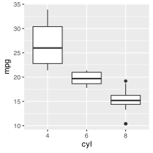
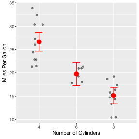
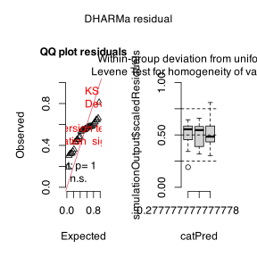
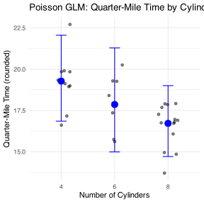
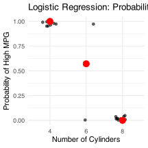
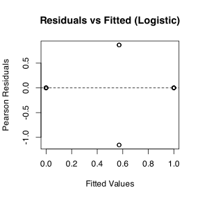
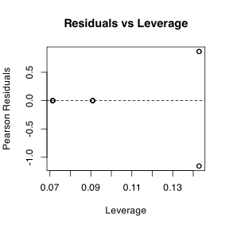
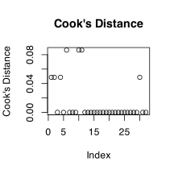
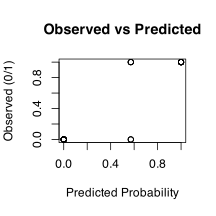

# Lecture 14: Generalized Linear Models Overview

Generalized Linear Models (GLMs) extend linear models to handle different types of response variables:

-   **Normal distribution**: Continuous data (like regular ANOVA/regression)
-   **Poisson distribution**: Count data
-   **Binomial distribution**: Binary data (presence/absence, success/failure)
-   **Gamma distribution**: Positive continuous data
-   **Negative binomial**: Overdispersed count data

## The Three Components of GLMs

1.  **Random component**: The response variable and its probability distribution
2.  **Systematic component**: The predictor variables (continuous or categorical)
3.  **Link function**: Connects expected value of Y to predictor variables

# Part 1: Gaussian GLM (equivalent to normal ANOVA)

Let's start with a familiar example using the mtcars dataset to show that Gaussian GLMs are equivalent to regular linear models.


::: {.cell}

```{.r .cell-code}
# Convert cylinders to factor
mtcars <- mtcars %>%
  mutate(cyl = factor(cyl))

mtcars %>% ggplot(aes(cyl, mpg))+
  geom_boxplot()
```

::: {.cell-output-display}

:::
:::

::: {.cell}

```{.r .cell-code}
# Fit standard linear model
model_lm <- lm(mpg ~ cyl, data = mtcars)

# Fit equivalent Gaussian GLM  
model_gaussian <- glm(mpg ~ cyl, 
                      data = mtcars, 
                      family = gaussian(link = "identity"))
model_gaussian
```

::: {.cell-output .cell-output-stdout}

```

Call:  glm(formula = mpg ~ cyl, family = gaussian(link = "identity"), 
    data = mtcars)

Coefficients:
(Intercept)         cyl6         cyl8  
     26.664       -6.921      -11.564  

Degrees of Freedom: 31 Total (i.e. Null);  29 Residual
Null Deviance:	    1126 
Residual Deviance: 301.3 	AIC: 170.6
```


:::
:::

::: {.cell}

```{.r .cell-code}
# Compare coefficients - should be identical
summary(model_lm)
```

::: {.cell-output .cell-output-stdout}

```

Call:
lm(formula = mpg ~ cyl, data = mtcars)

Residuals:
    Min      1Q  Median      3Q     Max 
-5.2636 -1.8357  0.0286  1.3893  7.2364 

Coefficients:
            Estimate Std. Error t value             Pr(>|t|)    
(Intercept)  26.6636     0.9718  27.437 < 0.0000000000000002 ***
cyl6         -6.9208     1.5583  -4.441             0.000119 ***
cyl8        -11.5636     1.2986  -8.905       0.000000000857 ***
---
Signif. codes:  0 '***' 0.001 '**' 0.01 '*' 0.05 '.' 0.1 ' ' 1

Residual standard error: 3.223 on 29 degrees of freedom
Multiple R-squared:  0.7325,	Adjusted R-squared:  0.714 
F-statistic:  39.7 on 2 and 29 DF,  p-value: 0.000000004979
```


:::

```{.r .cell-code}
summary(model_gaussian)
```

::: {.cell-output .cell-output-stdout}

```

Call:
glm(formula = mpg ~ cyl, family = gaussian(link = "identity"), 
    data = mtcars)

Coefficients:
            Estimate Std. Error t value             Pr(>|t|)    
(Intercept)  26.6636     0.9718  27.437 < 0.0000000000000002 ***
cyl6         -6.9208     1.5583  -4.441             0.000119 ***
cyl8        -11.5636     1.2986  -8.905       0.000000000857 ***
---
Signif. codes:  0 '***' 0.001 '**' 0.01 '*' 0.05 '.' 0.1 ' ' 1

(Dispersion parameter for gaussian family taken to be 10.38837)

    Null deviance: 1126.05  on 31  degrees of freedom
Residual deviance:  301.26  on 29  degrees of freedom
AIC: 170.56

Number of Fisher Scoring iterations: 2
```


:::

```{.r .cell-code}
# ANOVA for GLM
Anova(model_gaussian, type = "III", test = "F")
```

::: {.cell-output .cell-output-stdout}

```
Analysis of Deviance Table (Type III tests)

Response: mpg
Error estimate based on Pearson residuals 

          Sum Sq Df F values         Pr(>F)    
cyl       824.78  2   39.697 0.000000004979 ***
Residuals 301.26 29                            
---
Signif. codes:  0 '***' 0.001 '**' 0.01 '*' 0.05 '.' 0.1 ' ' 1
```


:::
:::

::: {.cell}

```{.r .cell-code}
# Calculate estimated means
emm_gaussian <- emmeans(model_gaussian, ~ cyl)
emm_df <- as.data.frame(emm_gaussian)

# Visualize results
ggplot() +
  geom_jitter(data = mtcars, 
              aes(x = cyl, y = mpg), 
              width = 0.2, alpha = 0.5) +
  geom_point(data = emm_df, 
             aes(x = cyl, y = emmean), 
             size = 4, color = "red") +
  geom_errorbar(data = emm_df, 
                aes(x = cyl, 
                    ymin = lower.CL, 
                    ymax = upper.CL), 
                width = 0.2, color = "red") +
  labs(
       x = "Number of Cylinders",
       y = "Miles Per Gallon") 
```

::: {.cell-output-display}

:::
:::


# Part 2: Poisson GLM for Count Data

Poisson GLMs are used for count data where the response variable consists of non-negative integers.


::: {.cell}

```{.r .cell-code}
# Create count-like data from mtcars
mtcars_count <- mtcars %>%
  mutate(qsec_round = round(qsec))  # Round quarter-mile time to create counts

# Fit Poisson GLM
model_poisson <- glm(qsec_round ~ cyl, 
                     family = poisson(link = "log"), 
                     data = mtcars_count)

# Model summary
summary(model_poisson)
```

::: {.cell-output .cell-output-stdout}

```

Call:
glm(formula = qsec_round ~ cyl, family = poisson(link = "log"), 
    data = mtcars_count)

Coefficients:
            Estimate Std. Error z value            Pr(>|z|)    
(Intercept)  2.95869    0.06868  43.079 <0.0000000000000002 ***
cyl6        -0.07629    0.11277  -0.676               0.499    
cyl8        -0.14243    0.09482  -1.502               0.133    
---
Signif. codes:  0 '***' 0.001 '**' 0.01 '*' 0.05 '.' 0.1 ' ' 1

(Dispersion parameter for poisson family taken to be 1)

    Null deviance: 5.6979  on 31  degrees of freedom
Residual deviance: 3.4487  on 29  degrees of freedom
AIC: 160.62

Number of Fisher Scoring iterations: 3
```


:::
:::

::: {.cell}

```{.r .cell-code}
# Check for overdispersion (important for Poisson models)
dispersion_poisson <- sum(residuals(model_poisson, type = "pearson")^2) / 
                     model_poisson$df.residual

cat("Dispersion parameter:", round(dispersion_poisson, 2), "\n")
```

::: {.cell-output .cell-output-stdout}

```
Dispersion parameter: 0.12 
```


:::

```{.r .cell-code}
cat("If > 1.5, consider negative binomial model\n")
```

::: {.cell-output .cell-output-stdout}

```
If > 1.5, consider negative binomial model
```


:::

```{.r .cell-code}
# DHARMa diagnostics
sim_residuals <- simulateResiduals(fittedModel = model_poisson)
plot(sim_residuals, main = "Poisson Model Diagnostics")
```

::: {.cell-output-display}

:::
:::

::: {.cell}

```{.r .cell-code}
# Get estimated means on response scale
emm_poisson <- emmeans(model_poisson, ~ cyl, type = "response")
emm_poisson_df <- as.data.frame(emm_poisson)

# Visualize
ggplot() +
  geom_jitter(data = mtcars_count, 
              aes(x = cyl, y = qsec_round), 
              width = 0.2, alpha = 0.5) +
  geom_point(data = emm_poisson_df, 
             aes(x = cyl, y = rate), 
             size = 4, color = "blue") +
  geom_errorbar(data = emm_poisson_df, 
                aes(x = cyl, 
                    ymin = asymp.LCL, 
                    ymax = asymp.UCL), 
                width = 0.2, color = "blue") +
  labs(title = "Poisson GLM: Quarter-Mile Time by Cylinders",
       x = "Number of Cylinders",
       y = "Quarter-Mile Time (rounded)") +
  theme_minimal()
```

::: {.cell-output-display}

:::
:::


# Part 3: Negative Binomial for Overdispersed Count Data

When count data shows overdispersion (variance \> mean), use negative binomial instead of Poisson.


::: {.cell}

```{.r .cell-code}
# Fit negative binomial model if overdispersion detected
model_nb <- glm.nb(qsec_round ~ cyl, data = mtcars_count)
```

::: {.cell-output .cell-output-stderr}

```
Warning in theta.ml(Y, mu, sum(w), w, limit = control$maxit, trace =
control$trace > : iteration limit reached
Warning in theta.ml(Y, mu, sum(w), w, limit = control$maxit, trace =
control$trace > : iteration limit reached
```


:::

```{.r .cell-code}
summary(model_nb)
```

::: {.cell-output .cell-output-stdout}

```

Call:
glm.nb(formula = qsec_round ~ cyl, data = mtcars_count, init.theta = 2935650.009, 
    link = log)

Coefficients:
            Estimate Std. Error z value            Pr(>|z|)    
(Intercept)  2.95869    0.06868  43.079 <0.0000000000000002 ***
cyl6        -0.07629    0.11277  -0.676               0.499    
cyl8        -0.14243    0.09482  -1.502               0.133    
---
Signif. codes:  0 '***' 0.001 '**' 0.01 '*' 0.05 '.' 0.1 ' ' 1

(Dispersion parameter for Negative Binomial(2935650) family taken to be 1)

    Null deviance: 5.6979  on 31  degrees of freedom
Residual deviance: 3.4486  on 29  degrees of freedom
AIC: 162.62

Number of Fisher Scoring iterations: 1

              Theta:  2935650 
          Std. Err.:  121368753 
Warning while fitting theta: iteration limit reached 

 2 x log-likelihood:  -154.616 
```


:::

```{.r .cell-code}
  # Compare AIC values
  cat("Poisson AIC:", AIC(model_poisson), "\n")
```

::: {.cell-output .cell-output-stdout}

```
Poisson AIC: 160.6158 
```


:::

```{.r .cell-code}
  cat("Negative Binomial AIC:", AIC(model_nb), "\n")
```

::: {.cell-output .cell-output-stdout}

```
Negative Binomial AIC: 162.616 
```


:::

```{.r .cell-code}
  cat("Lower AIC indicates better model fit\n")
```

::: {.cell-output .cell-output-stdout}

```
Lower AIC indicates better model fit
```


:::
:::


# Part 4: Logistic Regression for Binary Data

Logistic regression models the probability of a binary outcome (0/1, absent/present, failure/success).


::: {.cell}

```{.r .cell-code}
# Create binary outcome from mtcars (high vs low MPG)
mtcars_binary <- mtcars %>%
  mutate(high_mpg = ifelse(mpg > median(mpg), 1, 0),
         high_mpg_factor = factor(high_mpg, 
                                 levels = c(0, 1), 
                                 labels = c("Low", "High")))

# Fit logistic regression
model_logistic <- glm(high_mpg ~ cyl, 
                      family = binomial(link = "logit"), 
                      data = mtcars_binary)

# Model summary
summary(model_logistic)
```

::: {.cell-output .cell-output-stdout}

```

Call:
glm(formula = high_mpg ~ cyl, family = binomial(link = "logit"), 
    data = mtcars_binary)

Coefficients:
            Estimate Std. Error z value Pr(>|z|)
(Intercept)    21.57    8813.91   0.002    0.998
cyl6          -21.28    8813.91  -0.002    0.998
cyl8          -43.13   11778.08  -0.004    0.997

(Dispersion parameter for binomial family taken to be 1)

    Null deviance: 44.2363  on 31  degrees of freedom
Residual deviance:  9.5607  on 29  degrees of freedom
AIC: 15.561

Number of Fisher Scoring iterations: 20
```


:::
:::

::: {.cell}

```{.r .cell-code}
# Calculate odds ratios and confidence intervals
coefs <- coef(model_logistic)
odds_ratios <- exp(coefs)
ci_logistic <- exp(confint(model_logistic))
```

::: {.cell-output .cell-output-stderr}

```
Waiting for profiling to be done...
```


:::

::: {.cell-output .cell-output-stderr}

```
Warning: glm.fit: fitted probabilities numerically 0 or 1 occurred
Warning: glm.fit: fitted probabilities numerically 0 or 1 occurred
Warning: glm.fit: fitted probabilities numerically 0 or 1 occurred
Warning: glm.fit: fitted probabilities numerically 0 or 1 occurred
Warning: glm.fit: fitted probabilities numerically 0 or 1 occurred
Warning: glm.fit: fitted probabilities numerically 0 or 1 occurred
Warning: glm.fit: fitted probabilities numerically 0 or 1 occurred
Warning: glm.fit: fitted probabilities numerically 0 or 1 occurred
Warning: glm.fit: fitted probabilities numerically 0 or 1 occurred
Warning: glm.fit: fitted probabilities numerically 0 or 1 occurred
Warning: glm.fit: fitted probabilities numerically 0 or 1 occurred
Warning: glm.fit: fitted probabilities numerically 0 or 1 occurred
Warning: glm.fit: fitted probabilities numerically 0 or 1 occurred
Warning: glm.fit: fitted probabilities numerically 0 or 1 occurred
Warning: glm.fit: fitted probabilities numerically 0 or 1 occurred
Warning: glm.fit: fitted probabilities numerically 0 or 1 occurred
Warning: glm.fit: fitted probabilities numerically 0 or 1 occurred
Warning: glm.fit: fitted probabilities numerically 0 or 1 occurred
Warning: glm.fit: fitted probabilities numerically 0 or 1 occurred
Warning: glm.fit: fitted probabilities numerically 0 or 1 occurred
Warning: glm.fit: fitted probabilities numerically 0 or 1 occurred
Warning: glm.fit: fitted probabilities numerically 0 or 1 occurred
Warning: glm.fit: fitted probabilities numerically 0 or 1 occurred
Warning: glm.fit: fitted probabilities numerically 0 or 1 occurred
Warning: glm.fit: fitted probabilities numerically 0 or 1 occurred
Warning: glm.fit: fitted probabilities numerically 0 or 1 occurred
Warning: glm.fit: fitted probabilities numerically 0 or 1 occurred
Warning: glm.fit: fitted probabilities numerically 0 or 1 occurred
Warning: glm.fit: fitted probabilities numerically 0 or 1 occurred
```


:::

::: {.cell-output .cell-output-stderr}

```
Warning: glm.fit: algorithm did not converge
```


:::

::: {.cell-output .cell-output-stderr}

```
Warning: glm.fit: fitted probabilities numerically 0 or 1 occurred
```


:::

```{.r .cell-code}
# Display odds ratios
cat("Odds Ratios:\n")
```

::: {.cell-output .cell-output-stdout}

```
Odds Ratios:
```


:::

```{.r .cell-code}
for(i in 1:length(odds_ratios)) {
  cat(names(odds_ratios)[i], ":", round(odds_ratios[i], 3), 
      " (95% CI:", round(ci_logistic[i,1], 3), "-", 
      round(ci_logistic[i,2], 3), ")\n")
}
```

::: {.cell-output .cell-output-stdout}

```
(Intercept) : 2322868255  (95% CI: 0 - NA )
cyl6 : 0  (95% CI: NA - Inf )
cyl8 : 0  (95% CI: 0 - 160544062370705409709783555202530938507659874381055507928755669002532004536406004685573669399652806726225040628025257028013915896721001767418731393707840362091271463988504990653744949995696124883147991207352858433946252276578980229354787753053250035646464 )
```


:::
:::

::: {.cell}

```{.r .cell-code}
# Create prediction data
pred_data <- data.frame(
  cyl = levels(mtcars_binary$cyl)
)

# Get predicted probabilities
pred_data$prob <- predict(model_logistic, 
                         newdata = pred_data, 
                         type = "response")

# Visualize
ggplot() +
  geom_jitter(data = mtcars_binary, 
              aes(x = cyl, y = high_mpg),
              height = 0.05, width = 0.2, alpha = 0.6) +
  geom_point(data = pred_data, 
             aes(x = cyl, y = prob), 
             size = 4, color = "red") +
  labs(title = "Logistic Regression: Probability of High MPG",
       x = "Number of Cylinders",
       y = "Probability of High MPG") +
  scale_y_continuous(limits = c(0, 1)) +
  theme_minimal()
```

::: {.cell-output .cell-output-stderr}

```
Warning: Removed 14 rows containing missing values or values outside the scale range
(`geom_point()`).
```


:::

::: {.cell-output-display}

:::
:::


# Part 5: Model Comparison and Selection


::: {.cell}

```{.r .cell-code}
# Compare different models using AIC
models <- list(
  "Gaussian" = model_gaussian,
  "Logistic" = model_logistic
)

# If we have count models
if(exists("model_nb")) {
  models$Poisson <- model_poisson
  models$NegBin <- model_nb
}

# Create comparison table
model_comparison <- data.frame(
  Model = names(models),
  AIC = sapply(models, AIC),
  Deviance = sapply(models, function(m) round(m$deviance, 2)),
  Parameters = sapply(models, function(m) length(coef(m)))
)

model_comparison 
```

::: {.cell-output .cell-output-stdout}

```
            Model       AIC Deviance Parameters
Gaussian Gaussian 170.56395   301.26          3
Logistic Logistic  15.56071     9.56          3
Poisson   Poisson 160.61579     3.45          3
NegBin     NegBin 162.61596     3.45          3
```


:::
:::


# Part 6: Assumption Checking


::: {.cell}

```{.r .cell-code}
# Residuals vs fitted
plot(fitted(model_logistic), residuals(model_logistic, type = "pearson"),
     main = "Residuals vs Fitted (Logistic)",
     xlab = "Fitted Values", ylab = "Pearson Residuals")
abline(h = 0, lty = 2)
```

::: {.cell-output-display}

:::
:::

::: {.cell}

```{.r .cell-code}
# Leverage plot
leverage <- hatvalues(model_logistic)
plot(leverage, residuals(model_logistic, type = "pearson"),
     main = "Residuals vs Leverage",
     xlab = "Leverage", ylab = "Pearson Residuals")
abline(h = 0, lty = 2)
```

::: {.cell-output-display}

:::
:::

::: {.cell}

```{.r .cell-code}
# Cook's distance
cook <- cooks.distance(model_logistic)
plot(cook, main = "Cook's Distance",
     ylab = "Cook's Distance")
abline(h = 4/length(cook), lty = 2, col = "red")
```

::: {.cell-output-display}

:::

```{.r .cell-code}
# Observed vs predicted
predicted_probs <- predict(model_logistic, type = "response")
plot(predicted_probs, mtcars_binary$high_mpg,
     main = "Observed vs Predicted",
     xlab = "Predicted Probability", ylab = "Observed (0/1)")
```

::: {.cell-output-display}

:::
:::

::: {.cell}

```{.r .cell-code}
# Observed vs predicted
predicted_probs <- predict(model_logistic, type = "response")
plot(predicted_probs, mtcars_binary$high_mpg,
     main = "Observed vs Predicted",
     xlab = "Predicted Probability", ylab = "Observed (0/1)")
```

::: {.cell-output-display}

:::
:::


# Summary

::: {.callout-important appearance="simple"}
## Key Points from GLM Analysis

1.  **Gaussian GLMs** with identity link are equivalent to standard linear models/ANOVA
2.  **Poisson GLMs** are appropriate for count data, but check for overdispersion
3.  **Negative binomial** models handle overdispersed count data better than Poisson
4.  **Logistic regression** models binary outcomes using the logit link function
5.  **Model comparison** using AIC helps select the best model
6.  **Diagnostic plots** are essential for checking model assumptions
7.  **Odds ratios** in logistic regression show multiplicative effects on odds

Choose the appropriate GLM family based on your response variable: - Normal/continuous → Gaussian - Counts → Poisson (or negative binomial if overdispersed)\
- Binary → Binomial (logistic regression)
:::

Remember: GLMs provide a unified framework for many different types of analyses you might encounter in biological research!